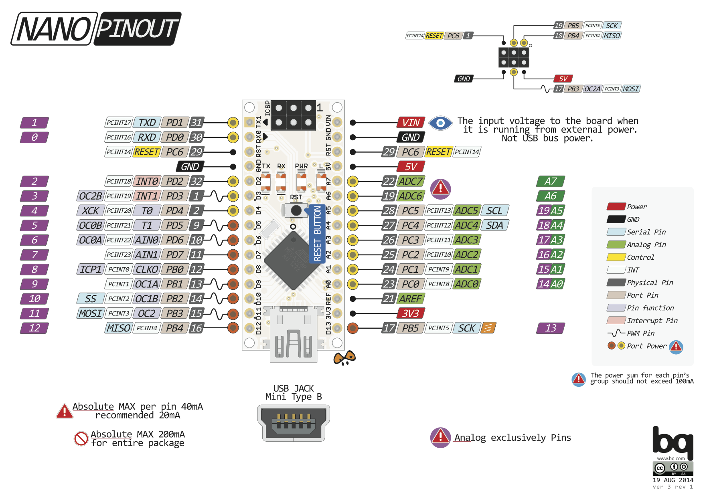

= Pin layout

Here are few pin layouts:

== Arduino Pro Mini

image:Arduino-ProMini-pinout.png[Arduino Pro Mini]

== Arduino Nano

== Arduino Uno

image:Arduino-uno-Pinout.png[Arduino Uno]

== JeeLab Node

image:Arduino-Jeenode-v6-pinout.png[JeeLab Node v6]

== ESP 8266

=== Wemos D1 mini

image:Esp12-Wemos-D1-mini.png[Wemos D1 mini]

=== Node MCU

image:nodemcudevkit_v1-0_io.jpg[Node MCU ESP-12]

== ESP 32

=== Node MCU 32S