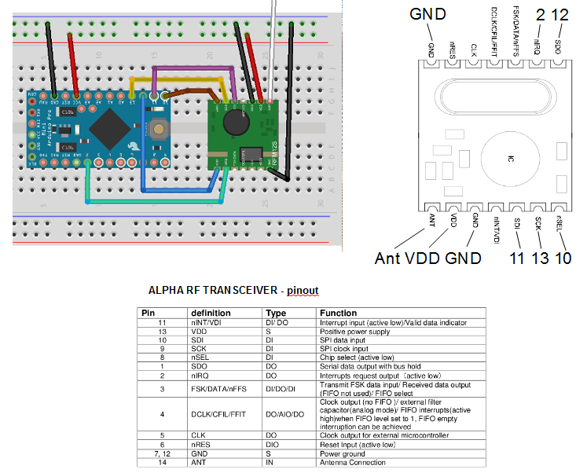

= Radio

== Links

* http://hallard.me/tag/rfm69cw/[RFM12 board]
* https://github.com/jcw/jeelib[Low Power libraries + radio]

== RFM12/RFM69CW

Radio module such as RFM12/RFM69CW can be used.

* http://openenergymonitor.org/emon/buildingblocks/rfm12b-wireless[Wiring RFM69CW]

Once wired, it is possible to verify by uploading JeeLabs RFM12 Demo sketch to have nodes discuss together.

[NOTE]
====
Enable RFM69/12 "compat" mode when using RFM69CW.
====

Antenna for 868MHz is 17,3 cm

== Bluetooth

* link:http://www.martyncurrey.com/hm-10-bluetooth-4ble-modules/[]
* link:http://www.instructables.com/id/ESP32-BLE-Android-App-Arduino-IDE-AWESOME/[]
* link:https://www.dfrobot.com/blog-964.html[]