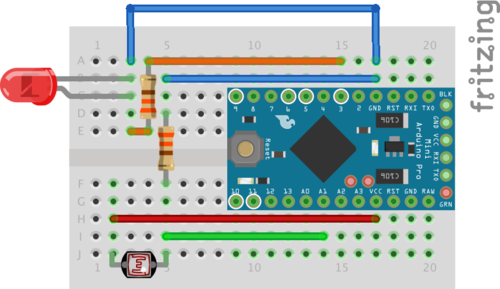

= Sensors Light

== LDR



* 60k < resistor < 400k (the higher the less power consumption, but less precise too)
* then callibrate to have an output between 0 and 256

```js
int LDR_Pin = A0; //analog pin 0

void setup(){
  Serial.begin(9600);
}

void loop()
{
  int32_t LDRReading = analogRead(LDR_Pin);

  int32_t LDRfinal = map(LDRReading, 200, 1024, 0, 100);
  Serial.println(LDRfinal);
  delay(250); 
}
```

== TSL2561

This is standard i2c wiring.

* For arduino: SCL=A5 and SDA=A4
* For ESP12: SCL=D1 and SDA=D2

Links:

* link:https://learn.adafruit.com/tsl2561/wiring[Wiring]
* link:https://github.com/adafruit/TSL2561-Arduino-Library[Library]
* link:https://makersportal.com/blog/2018/4/19/arduino-light-sensor-tsl2561-and-experiments-with-infrared-and-visible-light[Experience]

== AS7262 6-Channel Visible Light / Color Sensor

Example:

* link:https://www.instructables.com/id/A-Mimimal-Six-Color-Transmitted-Light-Spectrophoto/[]

Links:

* link:https://store.open-electronics.org/Spectrometer-breakout-mounted-breakout021[Spektrometer board] and link:https://www.open-electronics.org/lets-build-a-spectrometer/[Usage]
* link:https://www.adafruit.com/product/3779[AS7262 6-Channel Visible Light / Color Sensor]
* link:https://www.robotshop.com/eu/fr/platine-deploiement-pour-capteur-pir-as7262-visible-qwiic.html#shopping-cart-estimate-box[at robotshop]