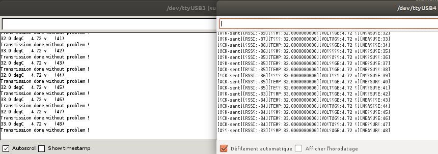

= RFM12/RFM69CW

NOTE: Below uses RFM12B and RFM69CW layouts which are compatible pins and at 868MHz.

== Wiring

image::/res/ArduinoProMini33-RF-sensor_bb-full.png[RFM12 / RFM69CW wiring on 3.3v board]

[NOTE]
====
Antenna length:    

433 1/4 wave = 164.7mm
433 1/2 wave = 329.4mm
433 full wave = 692.7mm

868 1/4 wave = 82.2mm
868 1/2 wave = 164.3mm
868 full wave = 345.5mm
====

== Sketch and Console

Setup emitter and receiver as seen at:

* link:/sketches/radio-rf69-send/radio-rf69-send.ino[]
* link:/sketches/radio-rf69-recv/radio-rf69-recv.ino[]

Console example result:

== Links

* link:http://hallard.me/tag/rfm69cw/[RFM12 board]
* link:https://github.com/jcw/jeelib[Low Power libraries + radio]
* link:http://openenergymonitor.org/emon/buildingblocks/rfm12b-wireless[Wiring RFM69CW]

[NOTE]
====
Using Jeelib, enable RFM69/12 "compat" mode when using RFM69CW.
====

