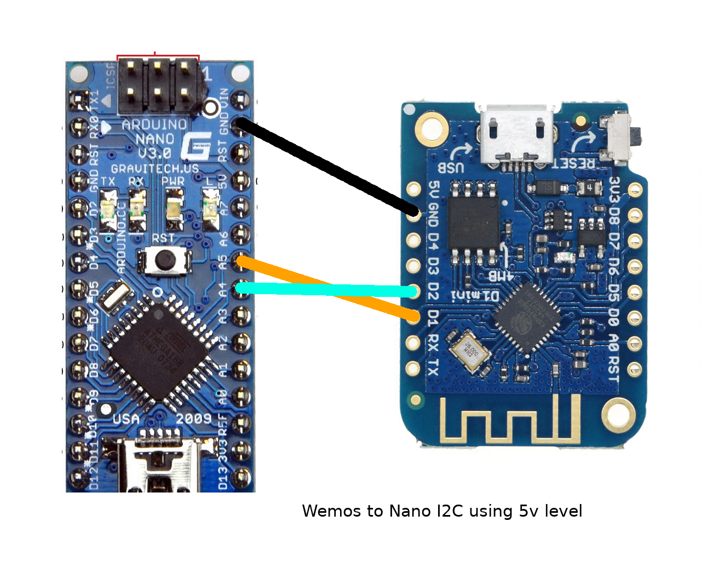

= Radio - I2C Connections

This is common pattern for communications between micro-controllers.

== Links

* link:https://randomnerdtutorials.com/esp32-i2c-communication-arduino-ide/[I2C tutorial]

== ESP8266 to Arduino Nano

image:ESP32-to-Arduino-Nano-5v.png[ESP32 to Nano]

This works similarly between other 5v components:

* Arduino Pro Mini
* Arduino Nano
* Wemos D1 mini (ESP8266)
* NodeMCU 32S (ESP32)

Note: ESP8266 and ESP32 boards such as Wemos or NodeMCU seem to be using 5v level.

Basic Sketch can be found at link:/src/main/sketches/I2C-inter-micro-controllers[I2C Master and Slave]

Usage is simply:

* to upload the master to ESP32 or ESP8266 and slave to Arduino
* open 2 consoles and run on correct ports *cat /dev/ttyUSBx* for each master and slave.
* One console should show *Sending=XXX*, while the other should be *Received=XXX* with obviously same *XXX*
