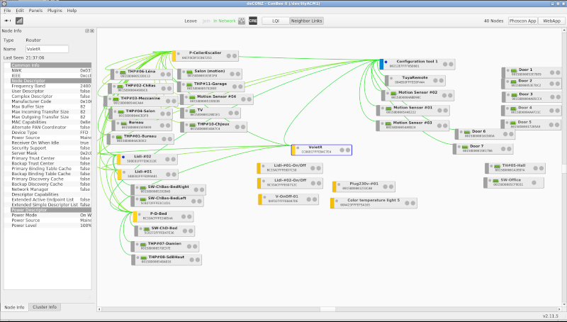
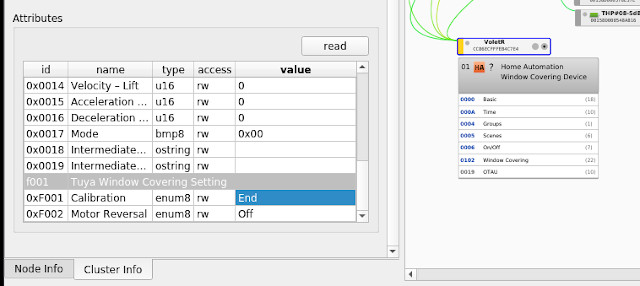

= Gateways - ZigBee
:hardbreaks:

== Products

.ZigBee Products
* link:https://zigbeealliance.org/fr/zigbee_products/[ZigBee Alliance]

.Gateway
* link:https://phoscon.de/en/conbee2[ConBee II]
* link:https://phoscon.de/en/app/doc[Official doc]

.Recommended
* link:https://www.phoscon.de/en/conbee2/software#phoscon-app[Hue Essentials]
* link:https://community.jeedom.com/t/tuto-groupes-et-binding-avec-phoscon-ou-hue-essentials-deconz/45108[Tutorial Bind ZigBee]

== Software

* link:https://github.com/marthoc/docker-deconz[Docker Deconz]
* link:https://flows.nodered.org/node/node-red-contrib-deconz[NodeRed deconz]
* link:http://dresden-elektronik.github.io/deconz-rest-doc[Deconz API doc]

== Firmware

* link:http://deconz.dresden-elektronik.de/deconz-firmware/?C=M;O=D[Firmware page]
* link:https://github.com/dresden-elektronik/deconz-rest-plugin/issues/2493[Tips]

**  Unplug the ConBee II
**  Start the command (with -t parameter)
**  Plugin the ConBee II again

.Find devices
[source,bash]
----
$ ls -l /dev/serial/by-id
...
usb-dresden_elektronik_ingenieurtechnik_GmbH_ConBee_II_DE2213620-if00 -> ../../ttyACM1
----

Notes:
- previous OK firmware: 0x26580700
- currently used: 0x266b0700

.Flash
[source,bash]
----
$ docker run -it --rm --entrypoint "/bin/bash" --privileged --cap-add=ALL -v $(pwd):/firmware -v /dev:/dev -v /lib/modules:/lib/modules -v /sys:/sys marthoc/deconz
root@69a522554758:/# /usr/bin/GCFFlasher_internal -d /dev/ttyACM0 -t 60 -R 10 -f /firmware/deCONZ_ConBeeII_0x266b0700.bin.GCF
GCFFlasher V3_17 (c) dresden elektronik ingenieurtechnik gmbh
Reboot device /dev/serial/by-id/usb-dresden_elektronik_ingenieurtechnik_GmbH_ConBee_II_DE2213620-if00 (ConBee II)
deCONZ firmware version 26580700
R21B18 Bootloader
Vers: 2.07
build: Jun 17 2019
flashing 164377 bytes: |==============================|
verify: .
SUCCESS
Wait 10 seconds until application starts
----

== Usage

=== Running deCONZ as docker

image:screenshot-zigbee-deconz.png[]

.Enable dialout
[source,bash]
----
$ sudo usermod -a -G dialout $USER
----

.Run as docker container
[source,bash]
----
$ docker run -d \
    --name=deconz \
    -p 8080:8080 \
    -p 8443:8443 \
    --restart=always \
    -v /etc/localtime:/etc/localtime:ro \
    -v /opt/deconz:/root/.local/share/dresden-elektronik/deCONZ \
    -e DECONZ_WEB_PORT=8080 \
    -e DECONZ_WS_PORT=8443 \
    -e DECONZ_DEVICE=/dev/ttyZigbee \
    --device=/dev/ttyZigbee \
    marthoc/deconz
----

.Run using docker-compose
[source,yaml]
----
version: "2"
services:
  deconz:
    image: marthoc/deconz
    ports:
      - 7080:7080
      - 7443:7443
      - 7900:5900
    volumes:
      - /etc/localtime:/etc/localtime:ro
      - ./etc/deconz:/root/.local/share/dresden-elektronik/deCONZ
      - /run/udev:/run/udev:ro  # so that serial number vendor/product ids are known
    device_cgroup_rules:
      - 'c 166:* rmw' # allow creation of /dev/ttyACMx nodes via mknod
      - 'c 188:* rmw' # allow creation of /dev/ttyUSBx nodes via mknod
    devices:
      - /dev/bus/usb
    environment:
      - DECONZ_WEB_PORT=7080
      - DECONZ_WS_PORT=7443
      - DECONZ_VNC_MODE=1
      - DECONZ_VNC_PORT=5900
      - DECONZ_VNC_PASSWORD=${ZIGBEE_DECONZ_VNC_PASSWORD:-password}
      - DEBUG_INFO=1
      - DEBUG_APS=0
      - DEBUG_ZCL=0
      - DEBUG_ZDP=0
      - DEBUG_OTAU=0
----

.Browse to link:http://localhost:7080[]

.Open a VNC onto localhost:7090 and default *password*

=== Running as native

.Default credentials
delight/delight

=== Tips

Browse to Configuration => Gateway, then Click on Advanced with pressing Shift+Alt

== Deconz API

From link:http://dresden-elektronik.github.io/deconz-rest-doc[Official Deconz API doc]

.Get API token (pre-requisit: browse to Hamburger menu -> Gateway -> Advanced -> Click ‘Authenticate app’)
[source,bash]
----
$ curl -d '{ "devicetype": "Node-RED"}' -H "Content-Type: application/json" -X POST http://192.168.1.46:40450/api
...
# Token is returned
----

.List sensors
[source,bash]
----
$ curl -H "Content-Type: application/json" http://192.168.1.46:40450/api/XXAAXX/sensors | jq .
...
----

.Touchlink
[source,bash]
----
$ curl -H "Content-Type: application/json" -X POST http://192.168.1.46:40450/api/9598E1143E/touchlink/scan
----

== Deconz WebSocket API

.WebSocket configuration
[source,bash]
----
$ curl -H "Content-Type: application/json" http://192.168.1.46:40450/api/XXAAXX/config | jq .

{
  "UTC": "2020-08-23T18:31:17",
  "apiversion": "1.16.0",
  "backup": {
    "errorcode": 0,
    "status": "idle"
  },
  "bridgeid": "XOXOXOXOXO",
  "datastoreversion": "93",
  "devicename": "RaspBee",
  "dhcp": true,
...
  "uuid": "606b08d1-5f14-4032-86cc-xxxxxx",
  "websocketnotifyall": true,
  "websocketport": 40460,
  "whitelist": {
    "XOXOXOXOXO": {
      "create date": "2020-08-22T18:40:34",
      "last use date": "2020-08-22T18:40:34",
      "name": "Node-RED"
    },
 ...
  },
  "zigbeechannel": 15
}
----

.WebSocket event listen (link:http://dresden-elektronik.github.io/deconz-rest-doc/websocket/[sample])
[source,js]
----
const WebSocket = require('ws');

const host = '192.168.1.46';
const port = 40460;

const ws = new WebSocket('ws://' + host + ':' + port);

ws.onmessage = function(msg) {
    console.log(JSON.parse(msg.data));
}
----

== References

.Custom ZigBee projects
* link:https://github.com/formtapez/ZigUP/[ZigUP]

To put the ZigBee device in detect mode and assign from ConBee II web UI:

.Xiaomi Aquara
* Magic Cube:
Hold reset for 3s
* Temp/Humi/Pressure device:
Hold reset until led light and blink

.Lidl
* link:https://www.zigbee2mqtt.io/devices/HG06337.html[Lidl 220v plug]
Hold button for 5s until power light blinks
* link:https://www.zigbee2mqtt.io/devices/HG06106C.html[Livarno Color Light Bulb]
When light up, shutdown, 3s, light up, 3s ... 3x time and keep up the last round, light should blink slowly

.IKEA devices
* Tradfri Light bulb: 
Reset and re-assign controller by light-on, then 6x light-off/on and stay on the 6th time. Bulb blinks.
* link:https://www.zigbee2mqtt.io/devices/E1524_E1810.html[Tradfri Dimmer switch]:
Click 4x times on reset button + light blinks
* Tradfri Remote ON/OFF switch:
Open device (screw), Click 4x times on reset button + light blinks
* Tradfri outlet:
Hold paper clip for 5s to enter registration mode.

.Tuya Zigbee
* 3 Gang Portable Remote:
Open the remote, click 5s on reset button
* 4 Gang Wall Remote:
Hold the Button 1 (bottom left) for 10s until blink
* Curtain Gang: 
Touch 5s the *pause* button to put in register. link:https://github.com/dresden-elektronik/deconz-rest-plugin/issues/3939#issuecomment-756901149[Calibration tips]

[source,bash]
----
- First ensure you curtain is fully closed.
- Set the calibration to "start" and click Write. Now you are in Calibration mode.
- Above, click on the Exec button in the function Up / Open. In the calibration mode the 30 secondes duration is disable.
- Once your curtain is fully open click on the "Exec" button in the function "Stop"
- Click on the Exec button in the function Down / Close
- Once your curtain is fully closed click on the "Exec" button in the function "Stop"
- Set the calibration to "end" and click Write
----

.Other links:
* link:https://presentationdeconz.wordpress.com/procedure-appairage-des-appareils-zigbee/[ConBee II Register devices]

