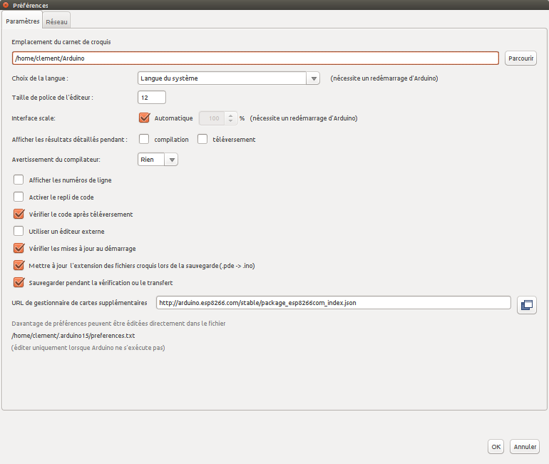
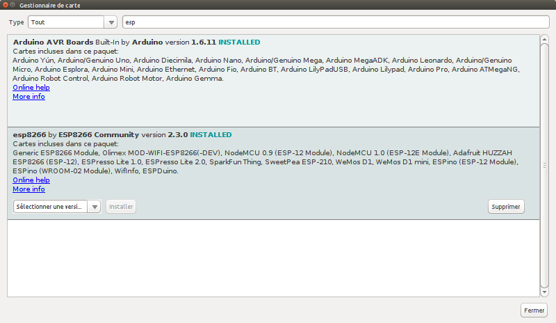

= Setup Arduino IDE for ESP8266
:toc: macro
:hardbreaks:

ifdef::env-github[]
:binariesdir: /project/src/main/adoc/binaries
:giturl: 
:imagesdir: /project/src/main/adoc/images
//:sectlinks:
//:sectnums:
// Admonitions
:tip-caption: :bulb:
:note-caption: :information_source:
:important-caption: :heavy_exclamation_mark:
:caution-caption: :fire:
:warning-caption: :warning:
endif::[]

ifndef::env-github[]
:imagesdir: /project/src/main/adoc/categories/setups/
endif::[]

Follow link:https://github.com/esp8266/Arduino[this guide] to setup ESP8266 board in Arduino IDE

Documentation is link:http://esp8266.github.io/Arduino/versions/2.3.0/[here]

== Procedure

- Import ESP Board into Arduino IDE

Add *https://arduino.esp8266.com/stable/package_esp8266com_index.json* to libraries.

- Load the Libraries for ESP8266

- Load sample _hello_ app into NodeMCU

In Arduino IDE, select proper board, example:
- Tools/Cards/NodeMCU 1.0 board
- CPU 160 MHz
- <correct USB device>

Create sketch such as the link:/src/main/sketches/esp8266-led/esp8266-led.ino[ESP8266 LED]

[source,C]
----
void setup() {
  // initialize digital pin 2 as an output.
  pinMode(2, OUTPUT);
}

// the loop function runs over and over again forever
void loop() {
  digitalWrite(2, HIGH);   // turn the LED on (HIGH is the voltage level)
  delay(1000);              // wait for a second
  digitalWrite(2, LOW);    // turn the LED off by making the voltage LOW
  delay(1000);              // wait for a second
}
----

LED should blink as shown below:

image:esp8266-led.jpg[NodeMCU Blink]

- Control a Wifi LED

 - Upload sketch found at link:/src/main/sketches/esp8266-led-wifi/esp8266-led-wifi.ino[ESP8266 LED WIFI] with changing Wifi network settings
 - Open Serial Consoleon Arduino IDE
 - Ensure from logs that NodeMCU connected to local Wifi
 - Browse to IP address logged out
 - Click on button to switch led On and Off

image:esp8266-led-wifi.png[NodeMCU Blink Wifi]

== File System

See link:https://github.com/esp8266/arduino-esp8266fs-plugin[SPIFFS filesystem]
